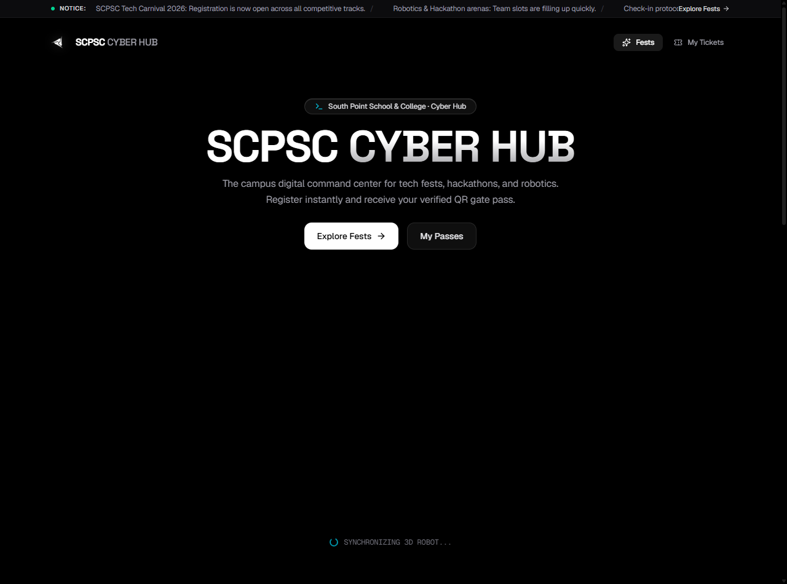
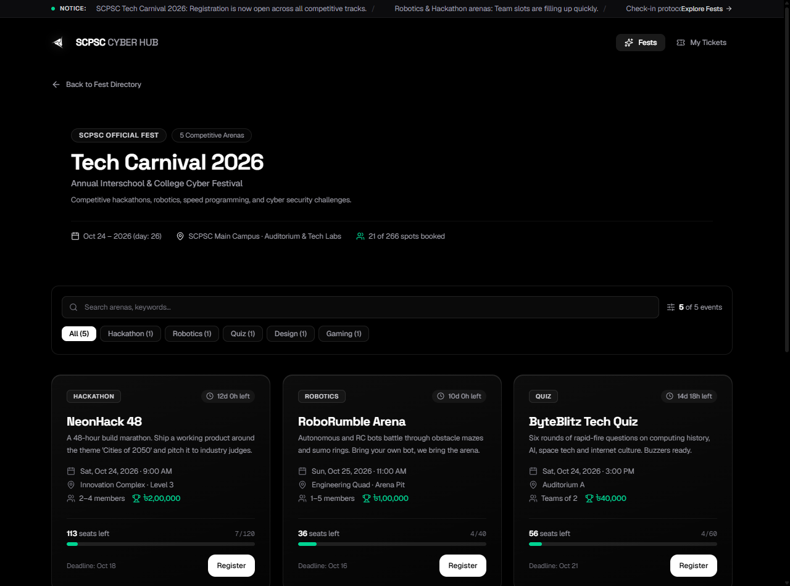
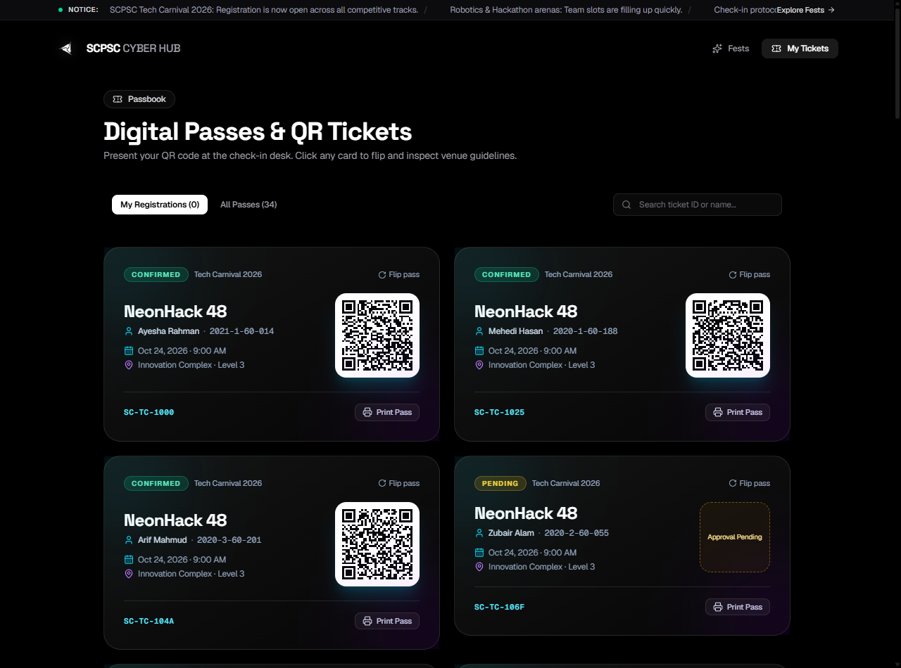
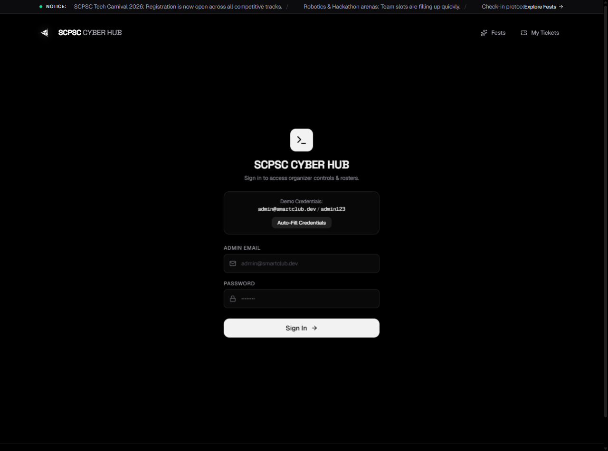

# SCPSC CYBER HUB (`smart-club-ops`)

> Official Campus Tech Festival, Event Operations & Digital Ticketing Platform for the **9th DRMC International Tech Carnival 2026** (AI Web Development Contest).

[](https://opensource.org/licenses/MIT)
[](https://nextjs.org/)
[](https://www.typescriptlang.org/)
[](https://tailwindcss.com/)

---

## 1. Project Name
**SCPSC CYBER HUB** (`smart-club-ops`)  
*Theme:* **Smart Club Operations** — Eliminating Google Forms with an end-to-end digital festival command center.

---

## 2. Project Description
**SCPSC CYBER HUB** is an open-source, high-performance web platform built for student organizations (such as the DRMC IT Club) to manage competitive tech carnivals, hackathons, and workshops.

Traditionally, student clubs rely heavily on third-party spreadsheets and Google Forms for event registrations, resulting in chaotic data collection, lack of deadline/capacity enforcement, and unprofessional attendee experiences. This platform provides:
- **Hierarchical Festival Engine:** `Organization → Fests → Events → Registrations`.
- **Attendee Portal:** Interactive 3D Spline robot hero, responsive festival directory, real-time seat tracking, and instant cryptographic QR gate pass ticketing.
- **Organizer Operations Console:** Dedicated `/ops` control room with live velocity metrics, category distribution charts, participant verification toggles, and CSV data exports.

---

## 3. Features Breakdown (120 Pts + Contest Guidelines)

### A. Fest Directory (30 Points)
- **Flagship Fest Showcases:** Explore upcoming festivals ("Tech Carnival 2026", "Winter Innovation Summit") with schedules, venues, and highlights.
- **Interactive Event Cards:** 3D hover physics, category badges, prize pools, and live capacity status badges.
- **Instant Search & Dynamic Filter:** Live client-side text query search across titles, venues, and categories with real-time count badges.
- **Dedicated Fest Detail Pages:** Full breakdowns at `/fests/[festId]` detailing arena dates, seat limits, and team guidelines.

### B. Registration System (30 Points)
- **Interactive Registration Modal:** Fluid slide-in form with keyboard traps, input validation (Student ID, email, phone, team info), and submission animation.
- **Real-Time Deadlines & Capacity Enforcement:** Live countdown timers with seat availability calculation. Automatically disables registration when capacity is reached or deadlines pass.
- **Cryptographic QR Gate Passes:** Confirmed registrations generate a scannable QR ticket encoding Ticket ID, Event ID, and Attendee verification hash.
- **Passbook View (`/tickets`):** Attendees can view, filter, and download their verified gate passes anytime.

### C. Organizer Management (`/ops` - 30 Points)
- **Hidden Operations Console:** Accessible directly via `/ops` and protected with session authentication (`/ops/login`).
- **Participant Roster:** Searchable and filterable table displaying participant name, email, student ID, ticket code, and registration timestamp.
- **Status Management:** One-click toggling between `Confirmed` and `Pending` with instant reactive feedback.
- **Analytics & Export Suite:**
  - 14-day Registration Velocity Area Chart.
  - Category Distribution Doughnut breakdown.
  - One-click CSV roster export.
  - One-click Demo Data Reset button for judges.

### D. Bonus & Creative Innovations (30 Points)
- **Interactive 3D Robot Hero:** Powered by `@splinetool/react-spline` with responsive GPU compositing, mouse tracking, and zero-lag performance.
- **Apple Liquid-Glass Dark Aesthetic:** Minimalist obsidian dark design system (`#000000`) with refined frosted glassmorphism and clean typography.
- **Zero-Backend Seed Persistence:** Reactive state machine backed by `localStorage` (`smart-club-ops:db:v1`), allowing seamless demonstration without complex cloud database setup.

---

## 4. Tech Stack

| Layer | Technology | Purpose |
|---|---|---|
| **Framework** | Next.js 16.3 (App Router) | Modern React Server & Client architecture |
| **Language** | TypeScript 5 | Strict typing and relational interface contracts |
| **Styling** | Tailwind CSS v4 | Next-gen CSS engine with hardware-accelerated tokens |
| **3D Graphics** | `@splinetool/react-spline` | Interactive 3D Cyber Robot hero scene |
| **Animation** | Framer Motion | Spring physics, page transitions, and modal choreographies |
| **Data Viz** | Recharts | 14-day velocity and category distribution analytics |
| **Ticketing** | `qrcode.react` | SVG QR code generator with cryptographic payload |
| **Icons** | Lucide React | Crisp, scalable icon system |

---

## 5. Setup & Installation Instructions

### Prerequisites
- Node.js **v18.18.0** or higher (Recommended: Node v20+)
- npm **v9.0** or higher

### 1. Clone & Install
```bash
# Clone the repository
git clone https://github.com/<your-username>/smart-club-ops.git

# Navigate into project directory
cd smart-club-ops

# Install dependencies
npm install
```

### 2. Run Local Development Server
```bash
npm run dev
```
Open **`http://localhost:3000`** in your browser.

### 3. Production Build
```bash
npm run build
npm run start
```

---

## 6. Deployment URL & Hosting Guide

- **Live Production URL:** Deployable with 1-click on [Vercel](https://vercel.com) or [Netlify](https://netlify.com).
- **Vercel Deployment Steps:**
  1. Push this repository to GitHub.
  2. Import repository into Vercel.
  3. Framework Preset: **Next.js** (Build command: `npm run build`, Output directory: `.next`).
  4. Deploy!

---

## 7. Demo Credentials (For Contest Judges)

The Organizer Management Console is hidden from public view and accessible via the `/ops` path:

- **Admin URL:** `/ops` or `/ops/login`
- **Email:** `admin@smartclub.dev`
- **Password:** `admin123`
- *Quick Action:* Click the **"Auto-Fill Demo Credentials"** button on the login screen for instant 1-click access.

---

## 8. Third-Party Services & APIs
- **Spline Runtime & CDN:** Streams the interactive 3D robot scene (`https://prod.spline.design/V1KrcrPjNNi8CcuO/scene.splinecode`).
- **QRCode Generator (`qrcode.react`):** Client-side vector QR encoding.
- **Local Storage API:** Client persistence engine with seed reconciliation.

---

## 9. AI Tools & Disclosures
In accordance with contest submission rules, the following AI tools and agents were used during development:
- **Agent:** DeepMind Antigravity AI Assistant.
- **Contributions:**
  - Architecture scaffolding and App Router layout structuring.
  - Mathematical viewport calibration and GPU acceleration for the 3D Spline scene.
  - Implementation of relational state stores, mock seed generators, and CSV data export.
  - UI refinement and Apple-inspired design tokens.

---

## 10. Screenshots

### 1. Hero Landing Page & Interactive 3D Cyber Robot


### 2. Event Explorer & Real-Time Capacity Tracking


### 3. Verified Cryptographic QR Gate Passes


### 4. Organizer Operations Console (`/ops`)


---

## 11. Known Limitations
1. **Client-Side Persistence:** Application state is stored in the browser's `localStorage` (`smart-club-ops:db:v1`). Any modifications made in one browser session will not synchronize to other machines unless connected to an external cloud database.
2. **Offline 3D Loading:** The Spline 3D robot model is streamed via Spline's CDN; an active internet connection is required on initial load to fetch the 3D assets.

---

## 12. License
Distributed under the **MIT License**. See [`LICENSE`](LICENSE) for full details.
